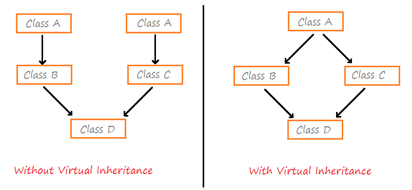

## Summary: ##

- inheritance
- "diamond" problem

- `virtual` superclass
- `virtual` destructors

Чтобы сделать суперкласс общим для двух потомков, используется ключевое слово `virtual`

В целях безопасности, при работе с наследованием, деструкторы должны быть виртуальными. Например, при работе с указателями, это позволит разрушить объект полностью.
